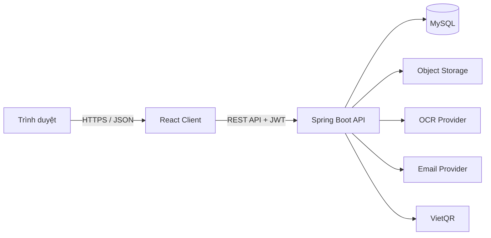

# Kiến trúc hệ thống



## Backend modules

```text
com.smartsplit
├── auth
├── user
├── group
├── expense
├── balance
├── settlement
├── notification
├── report
├── personal
├── ocr
└── common
```

## Nguyên tắc thiết kế

- Package theo tính năng thay vì gom toàn bộ controller/service/repository.
- Controller chỉ tiếp nhận HTTP, validate đầu vào và gọi service.
- Service chứa transaction và nghiệp vụ.
- Repository chỉ truy cập dữ liệu.
- Entity không được trả trực tiếp ra API; sử dụng request/response DTO.
- Mọi phép sửa khoản chi, người trả và phần chia phải nằm trong cùng transaction.
- Authorization kiểm tra cả vai trò và quan hệ thành viên với nhóm.
- Module `personal` tách dữ liệu cá nhân khỏi nhóm và luôn giới hạn truy vấn theo người dùng trong JWT.

## Luồng sổ chi tiêu cá nhân

1. Client chọn tháng và gọi API tổng hợp cá nhân.
2. Backend xác định người dùng từ JWT, không nhận `userId` từ client.
3. Khoản chi được lưu với danh mục dùng chung và không tạo payer/share/công nợ.
4. Tổng chi và tỷ trọng danh mục được tính trong phạm vi tháng đã chọn.
5. Ngân sách tháng được so sánh với tổng chi để trả số tiền còn lại hoặc mức vượt.

## Luồng tạo khoản chi

1. Client gửi thông tin khoản chi, người trả và phần chia.
2. Backend kiểm tra quyền thành viên.
3. Kiểm tra tổng tiền người trả.
4. Kiểm tra tổng phần phải chịu.
5. Ghi Expense, ExpensePayers và ExpenseShares trong một transaction.
6. Tạo thông báo cho thành viên liên quan.
7. Trả về khoản chi đã chuẩn hóa.

## Luồng OCR

1. Upload ảnh vào object storage.
2. Tạo OCR job trạng thái `PENDING`.
3. OCR provider trả văn bản thô.
4. Parser trích xuất cửa hàng, ngày, tổng tiền và thuế.
5. Lưu kết quả cùng confidence.
6. Người dùng sửa và xác nhận trước khi tạo khoản chi.
