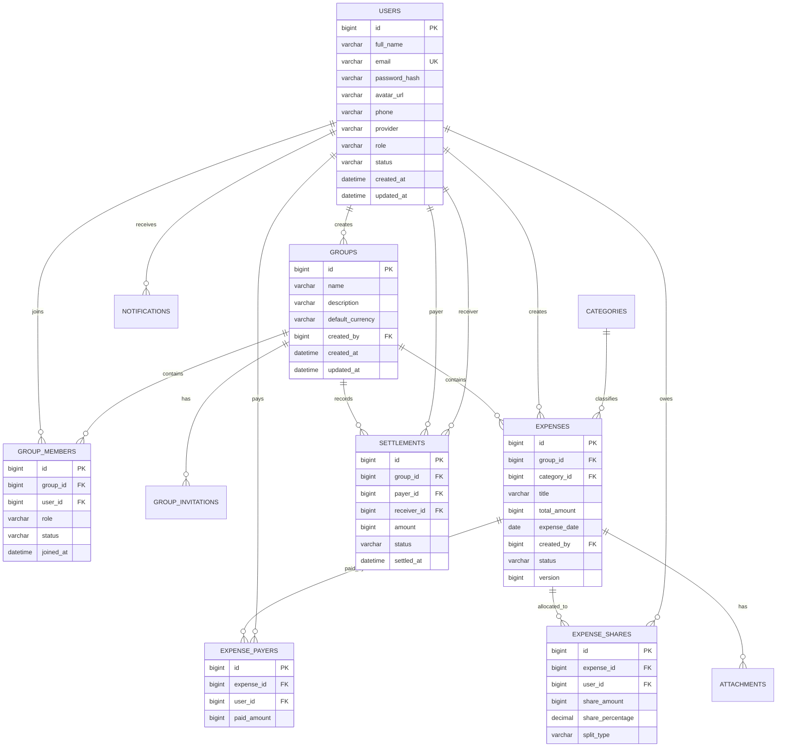

# ERD




## ReceiptScans — Iteration 5

```text
id
group_id
uploaded_by
category_id
original_name
storage_path
content_type
file_size
provider
status
raw_text
merchant
total_amount
expense_date
confidence
message
created_at
expires_at
attached_at
```

`ReceiptScans` lưu phiên nhận dạng trước khi khoản chi được tạo. Sau khi xác nhận, ảnh được liên kết với khoản chi qua bảng `Attachments`.
